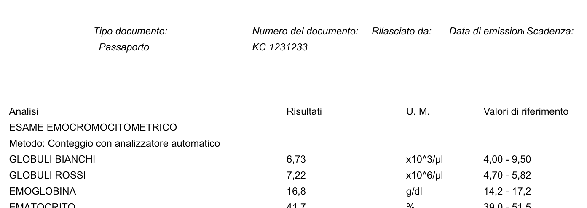
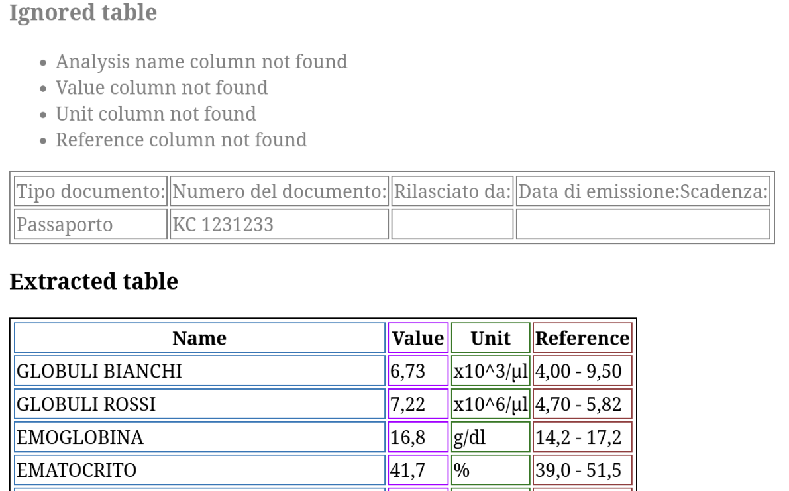

# Blood-Tests-Extractor

It extracts the blood test results from PDF or image files.

It runs an HTTP service that receives a PDF in a POST request and returns a JSON containing the information
for each analysis.

It can also be used locally for experiments; in this case, it reads a PDF file and generates an HTML file
containing the tables with analysis data and other debugging information.

The extraction of the tables from the PDF or images is based on the package [img2table](https://github.com/xavctn/img2table).

## Example

From a PDF containing:

<kbd>  </kbd>

With the request:

```shell
curl -F file=@examples/input/checkup-2025-01-15.pdf http://localhost:8000/blood-test-pdf | jq
```

You get the response:

```json
[
  {
    "name": "GLOBULI BIANCHI",
    "value": 6.73,
    "unit": "x10^3/μl",
    "reference": "4,00 - 9,50"
  },
  {
    "name": "GLOBULI ROSSI",
    "value": 7.22,
    "unit": "x10^6/μl",
    "reference": "4,70 - 5,82"
  },
  {
    "name": "EMOGLOBINA",
    "value": 16.8,
    "unit": "g/dl",
    "reference": "14,2 - 17,2"
  }
]
```

And executing:
```shell
python -m src.command_line examples/input/checkup-2025-01-15.pdf
```

It generates an HTML containing:

<kbd>  </kbd>

## Development

Install the dependencies with:

```shell
poetry install --with experiments
```

Run an extraction of the analysis tables from a PDF:

1. Copy a PDF with a blood test to `examples/input`
2. Run `source .venv/bin/activate` to use the poetry virtual environment
3. Run `python -m src.command_line examples/input/checkup-123.pdf`
4. Look at the generated HTML file(s) in `examples/output` 

Run the tests and coverage with:

```shell
coverage run -m unittest
```

Generate the coverage HTML report with:

```shell
coverage html
```

Run the http server with:

```shell
uvicorn src.http_api.main:app --reload
```

The code is formatted using `black`. Either configure the IDE to use it or run `black src/ tests/`. 

## TODO list
* Recognise the language first. In this way analysis name, decimal numbers, unit measure can be recognized more accurately.
* Recognise the type of column through machine learning instead of using the fixed `AnalysisTable.CONFIDENCE_THRESHOLD` 